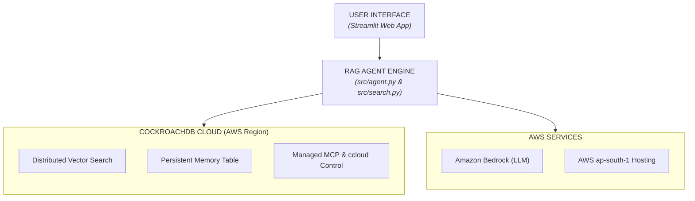

# ⚡ RoachMind — Persistent Agentic Memory RAG Engine

A production-grade Agentic RAG Platform built with **CockroachDB Cloud**, **Distributed Vector Indexing**, and **AWS Services** (Amazon Bedrock & AWS Infrastructure). Designed to maintain persistent, fault-tolerant context across multi-turn agent conversations.

---

## 🛠️ CockroachDB Tools & AWS Services Used

### 1. CockroachDB Distributed Vector Indexing
- **Usage:** Stores paper embeddings using native `VECTOR(384)` fields.
- **Implementation:** Executes high-throughput cosine distance vector search using the `<->` operator in `src/search.py` combined with keyword search for hybrid context retrieval.

### 2. CockroachDB Persistent Agentic Memory Layer
- **Usage:** Provides multi-turn memory state persistence across agent runs.
- **Implementation:** On every user query, the `conversation_memory` table logs the `session_id`, `question`, retrieved vector chunks (`JSONB`), `answer`, and `timestamp` in `src/memory.py`.

### 3. CockroachDB Managed MCP & ccloud CLI
- **Usage:** Used for cluster administration, database role management, and environment setup.

### 4. AWS Services (Amazon Bedrock & AWS Infrastructure)
- **AWS Hosted Cluster:** CockroachDB database hosted natively on AWS (`aws-ap-south-1`).
- **Amazon Bedrock:** Integrated via `boto3` (`bedrock-runtime`) in `src/agent.py` as the LLM reasoning and synthesis engine.

---

## 🏗️ Architecture Diagram



---

## 🚀 Quickstart & Setup Instructions

### 1. Prerequisites
- Python 3.10+
- CockroachDB Cloud Cluster Connection String

### 2. Local Setup

```bash
# Clone the repository
git clone [https://github.com/YOUR_GITHUB_USERNAME/rag-agent-platform.git](https://github.com/YOUR_GITHUB_USERNAME/rag-agent-platform.git)
cd rag-agent-platform

# Create virtual environment
python3 -m venv venv
source venv/bin/activate

# Install dependencies
pip install -r requirements.txt
```